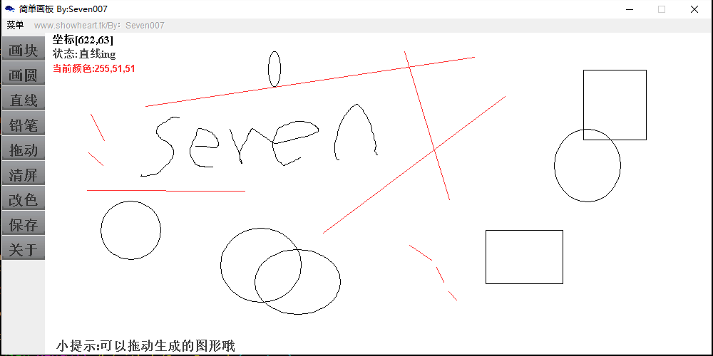
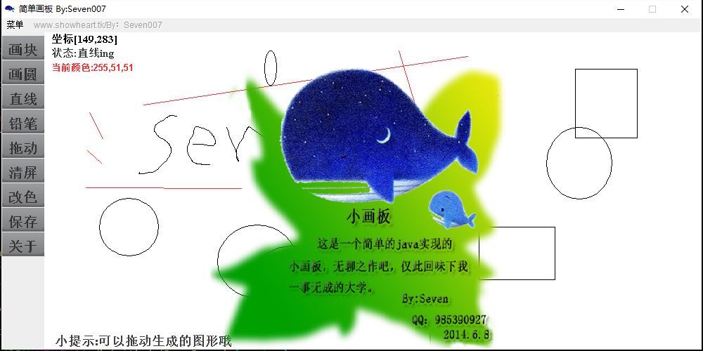

# JavaBoard
## JavaBoar简介
* JavaBoard是一个我初学Java的时候写的一个Swing画板程序
* 拥有铅笔 直线 圆形(未完善) 矩形(未完善) 选色 拖动 存图功能
* 初学Java编写，代码略混乱，有部分注释
* 程序涉及到Swing绘图 Swing基础控件 Swing事件监听机制 反射
* 整理文件发现，年久失修，且勿吐槽

##截图
* 主界面
    
* 关于
    

* 邮件(hacker.kill07@gmail.com)
* QQ: 985390927
* weibo: [@Alden_情绪控](http://weibo.com/Sweets07)
* Blog: [http://www.zhaoguilin.com](http://www.zhaoguilin.com)